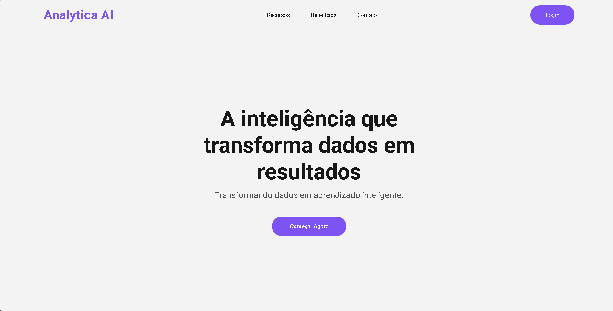
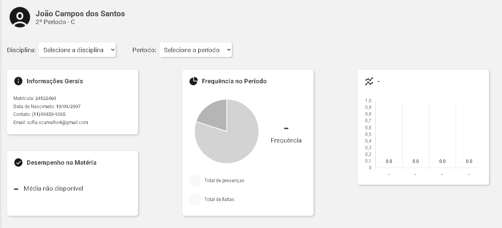
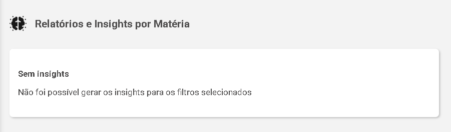
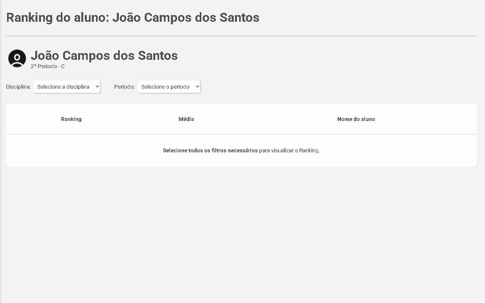
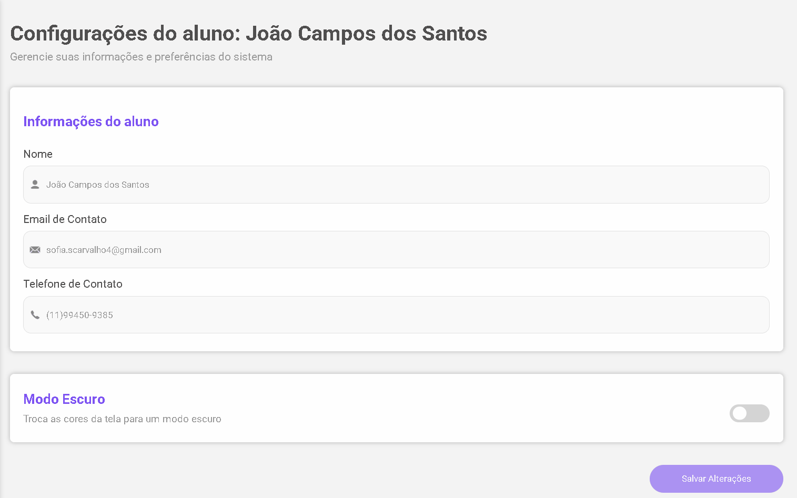

# Analityca AI - Sistema de Análise de Dados



## 📋 Sobre o Projeto

O Analityca AI é uma plataforma de análise de dados desenvolvida como Trabalho de Conclusão de Curso (TCC) do curso de Desenvolvimento de Sistemas do SENAI Jandira. A aplicação permite visualizar, analisar e extrair insights de conjuntos de dados de forma intuitiva e eficiente.

## ✨ Funcionalidades Principais

- **Dashboard Interativo**: Visualize seus dados em tempo real com gráficos interativos
- **Análise de Dados Avançada**: Gere relatórios detalhados e insights valiosos
- **Ranking de Desempenho**: Acompanhe métricas e desempenho em tempo real
- **Gerenciamento de Recursos**: Crie e gerencie recursos de forma simples
- **Configurações Personalizáveis**: Adapte a plataforma às suas necessidades

## 🎥 Demonstração

### Dashboard


### Análise de Dados


### Ranking


### Recursos


### Configurações


## 🛠️ Tecnologias Utilizadas

### Frontend
- React 19
- Vite
- Chart.js
- React Router DOM
- Styled Components

## 🚀 Como Executar o Projeto

### Pré-requisitos
- Node.js (versão 18 ou superior)
- npm ou yarn
- Git

### Instalação

1. Clone o repositório:
```bash
git clone https://github.com/campoos/Front-End-TCC-.git
```

2. Instale as dependências:
```bash
cd analityca-ai
npm install
# ou
yarn
```

3. Inicie o servidor de desenvolvimento:
```bash
npm run dev
# ou
yarn dev
```

4. Acesse a aplicação em:
```
http://localhost:5173
```

## � Equipe de Desenvolvimento

### Desenvolvedores
- **João Victor Campos dos Santos** - [GitHub](https://github.com/campoos) - Frontend
- **Jheniffer Rodrigues** - [GitHub](https://github.com/jhenifferrodrigues) - Backend
- **Giovanna Coelho** - [GitHub](https://github.com/VannaGilio) - Backend
- **Sofia Carvalho** - [GitHub](https://github.com/sofiascarvalho) - Mobile
- **Fabricio Camargo** - [GitHub](https://github.com/fabricio1011) - Mobile

### Orientadores
- Marcel Teixeira
- Yuri Silva
- Celso Furtado
- Fernando Leonid

## 📱 Repositórios do Projeto

- **Frontend**: [GitHub](https://github.com/campoos/Front-End-TCC-)
- **Backend**: [GitHub](https://github.com/VannaGilio/Back-End-TCC-)
- **Mobile**: [GitHub](https://github.com/sofiascarvalho/Mobile-TCC-)

---

Desenvolvido com ❤️ para o TCC de Desenvolvimento de Sistemas - SENAI Jandira - 2025
